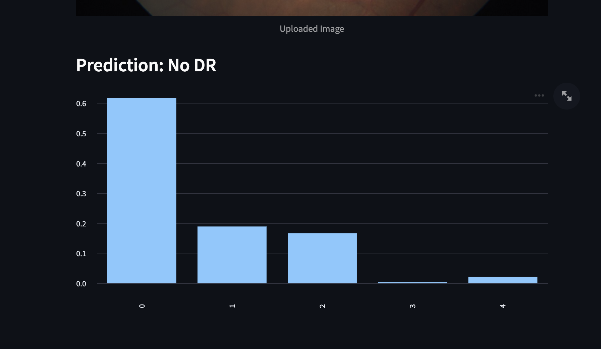

# 👁️ VisionCare AI: Diabetic Retinopathy Detection System

VisionCare AI is a deep learning-powered diagnostic tool for the early detection of diabetic retinopathy (DR) using retinal fundus images. Built with PyTorch and Streamlit, this end-to-end project enables real-time DR classification through a clean and interactive web interface.

---

## 🚀 Demo

📸 Upload a retinal fundus image and receive an instant prediction:



---

## 🧠 Features

- 🧬 ResNet50 CNN model trained on APTOS 2019 dataset
- 📊 Achieves 65% macro F1 score on validation set
- 🧾 Streamlit-powered UI for real-time inference
- 🧠 Five-class classification: No DR, Mild, Moderate, Severe, Proliferative DR
- 🔒 Model weights excluded from repo to ensure clean deployment

---

## 🧰 Tech Stack

| Component     | Tools / Libraries               |
|---------------|----------------------------------|
| Model         | PyTorch, ResNet50               |
| Augmentation  | Albumentations                  |
| Web App       | Streamlit                       |
| Image Proc    | OpenCV, PIL                     |
| Deployment    | Streamlit Cloud (optional)      |

---


---

## ⚙️ Setup & Installation

```bash
git clone https://github.com/ashritkvs/Vision-Care.git
cd Vision-Care
pip install -r requirements.txt
streamlit run app/main.py
